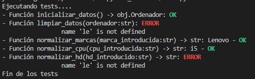

# Práctica 12. Python avanzado - Data cleaning

## Objetivo
Esta práctica pretende alcanzar los siguientes resultados de aprendizaje:
- Crear unidades de test.
- Identificar e implementar objetos básicos.
- Aprender a limpiar los datos de entrada mediante métodos de la clase string.
- Tipificación de funciones.
- Ejecutar programas por consola con envío de parámetros al programa principal.
- Aprender a seguir unos interfaces dados.

## Enunciado

El objetivo del programa será mostrar todos los ordenadores que posee una tienda de informática a partir de su marca. La entrada de la marca se realizará mediante los argumentos del programa main por medio de la consola. Si no somos capaces de conseguir esta funcionalidad, se pedirá por teclado. 

En el siguiente caso se buscará por Lenovo.

```
(base) C:\Users\davidcb\Python\asignatura\practicas\12.python_avanzado>C:/Users/davidcb/Anaconda3/python.exe c:/Users/davidcb/Python/practicas/12.python_avanzado/main.py Lenovo 
``` 

El programa trabajará con la información de ordenadores que suministrará la función siguiente. C&P el código en vuestro código:

```python
def inicializar_datos() -> list:
    ordenadores = []
    ordenadores.append("DEL  ,i5,8,256GB")
    ordenadores.append("H, Intel i7,8,HD: 128")
    ordenadores.append("Lenvo  ,Intel i5,8,  200")
    ordenadores.append("DLL,  Inteli5,8,ssd256")
    ordenadores.append("Lnovo, i7,  8,512gb")
    ordenadores.append("HC, Intel+ i7,16, HD1: 512Gb1")
    ordenadores.append("DLL,  Inteli5,8,ssd6")

    return ordenadores
```

Como se puede ver, la información se entrega en una lista donde cada elemento es un string con la información del ordenador separada por comas. Esta información está sucia, con muchas erratas y necesita ser limpiada para procesarla posteriormente, como en cualquier proceso de análisis de datos.

Los criterios de limpieza de los datos son los siguientes:
- Marca: se vinculará con la marca que más se parezca a los tres tipos que existen: DELL, HP y Lenovo. La similitud con cada marca la haremos por la mayor coincidencia en el número de caracteres a las marcas reales.
- CPU: todos los procesadores deberán tener 2 letras, empezarán por una "i" y terminarán con un número. Por ejemplo: i3, i5, i7, ...
- RAM: ahí hemos tenido suerte y todas las entradas son correctas.
- HD: el dato del disco duro, también viene muy sucio. Al menos deben ser 2 números consecutivos.

Como se puede ver, la última entrada no cumplirá con el último requisito, solo tiene un número de 1 dígito, por lo que no se podrá leer y deberá comunicarse al usuario este hecho.

Una vez leídos los ordenadores se almacenarán en la estructura más rápida posible que consiga dar la información solicitada y con el diseño más apropiado para la estructura de información que se suministra.

Se trabajará con el mejor tratamiento de errores posible que nos lleve a un código limpio y estructurado. 

Se deberán tipificar todas las funciones.


### Interfaces del programa

De forma obligatoria, el programa principal deberá trabajar con las siguientes funciones que definen los interfaces siguientes. Si el profesor tomara las siguientes funciones y las llamara desde su main, el programa debería trabajar perfectamente.

Los errores no serán ni descriptivos ni específicos porque la entrada que esté mal, se eliminará y no habrá ninguna posibilidad de recuperación. Se dice que este tipo de procesos son **batch**.

```python
def limpiar_datos(ordenador:str) -> Ordenador
    raise Exception

def normalizar_marcas(marca_introducida:str) -> str
    raise ValueError

def normalizar_cpu(cpu_introducida:str) -> str
    raise ValueError

def normalizar_hd(hd_introducido:str) -> str
    raise ValueError
```

### Etapa de Testing

El programa deberá testeado (validado) en todo momento gracias a un módulo de test que verifique la correcta funcionalidad de todas las funciones.

La salida será la siguiente:
```
Ejecutando tests....
- Función inicializar_datos() -> list: OK
- Función limpiar_datos(ordenador:str): HP i7 16 512 - OK
- Función normalizar_marcas(marca_introducida:str) -> str: Lenovo - OK
- Función normalizar_cpu(cpu_introducida:str) -> str: i5 - OK
- Función normalizar_hd(hd_introducido:str) -> str: 512 - OK
Fin de los tests
```



### Salida generada

```
Ordenadores Lenovo:
- Lenovo i5 8 200
- Lenovo i7 8 512
```


