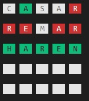

# Práctica 13. Ficheros - Wordlet PRO

## Objetivo
Esta práctica pretende alcanzar los siguientes resultados de aprendizaje:
- Crear unidades de test (pruebas unitarias de código).
- Dominar el proceso de lectura y escritura de ficheros de texto.
- Ejecutar programas por consola con envío de parámetros al programa principal.
- Modularización y tipificación de variables.
- Profundizar en el tratamiento de matrices.

## Enunciado

Se deberá partir de la "Práctica 5. Wordlet" y mejorar la funcionalidad para que cumpla con los siguientes requisitos técnicos y funcionales:
- El programa deberá tener tres módulos (ficheros.py) ejecutables:
    + **crear_fichero_5letras.py**: leerá el fichero de palabras suministrado "palabras.txt", deberá limpiarlo y generar un nuevo fichero llamado "palabras_worldlet.txt" el cual tendrá los siguientes requisitos de data-cleaning. Antes de poder empezar a jugar, deberemos ejecutar este programa para tener el fichero de palabras del juego.
        - Tomar solo las palabras de 5 letras.
        - Eliminar parabras con acentos.
        - Eliminar otros caracteres raros que puedan existir.
    + **worldlet.py**: ejecutará el juego en sí. Si recibe el argumento por consola 1, mostrará la palabra a adivinar. Si no recibe nada o cualquier otro valor se ejecutará normalemtne. Esto será útil cuando queramos hacer testing.
        - "python worldlet.py 1"
    + **test.py**: realizará las pruebas unitarias sobre las funciones realizadas.
- Adaptar el juego para que en lugar de trabajar con la estructura de cadenas de caracteres que teníamos, trabaje con una matriz de 5 x 5.
- Todas las funciones a realizar deberán estar tipificadas.

**Requisitos opcionales**:
- Mejorar la lógica del juego para que identifique correctamente las letras que existen pero no están bien colocadas. [Difícil] 
- Crear un fichero que guarde el histograma de resultados, como en el juego real. El objetivo es mostrar las veces que se ha resuelto el tablero a la primera palabra introducida, a la segunda, ... o no se ha adivinado. La salida, puede ser similar a la siguiente:
```
Estadísticas
------------
1 #
2 #
3 ##
4 ####
5 #####
X ###
```

### Salida del juego

